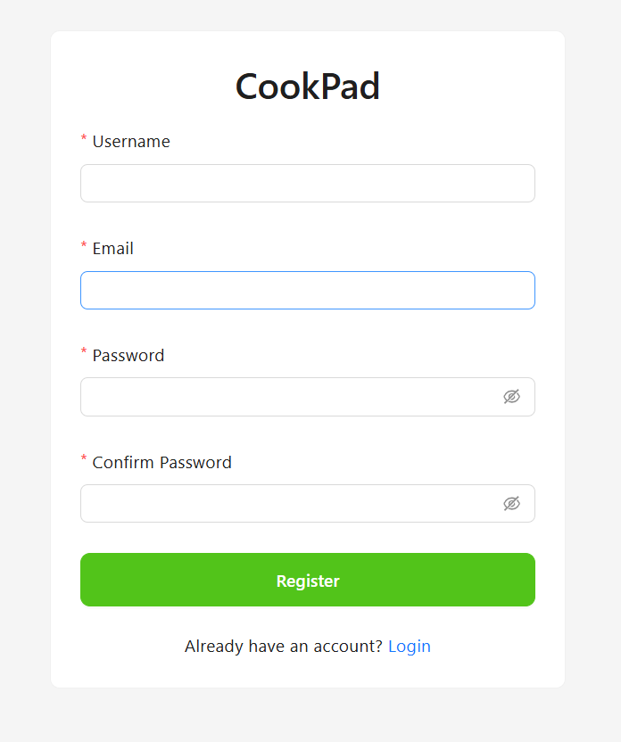
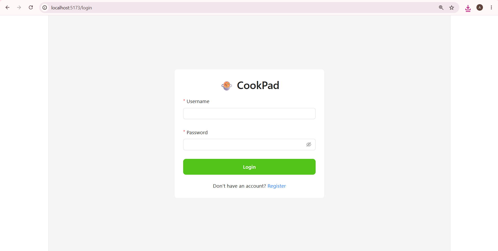
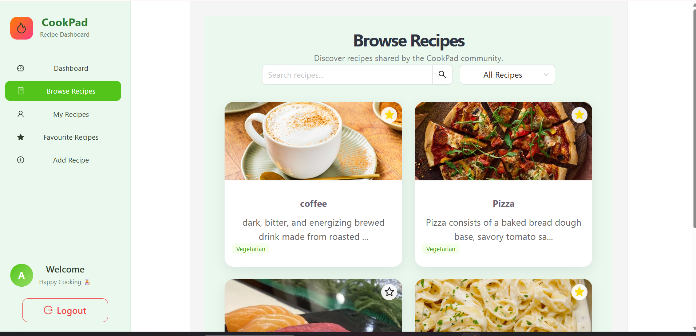
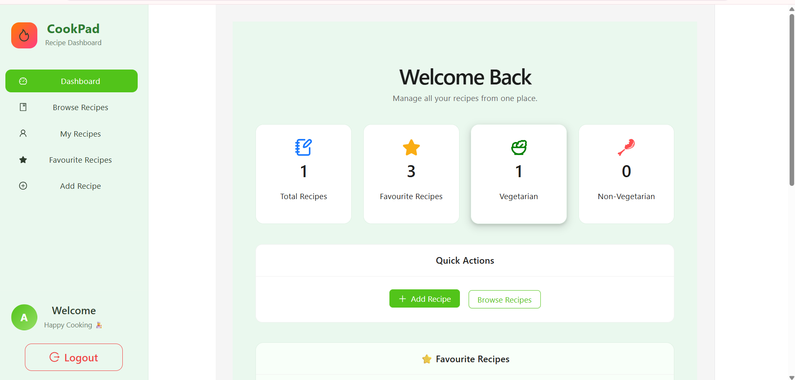
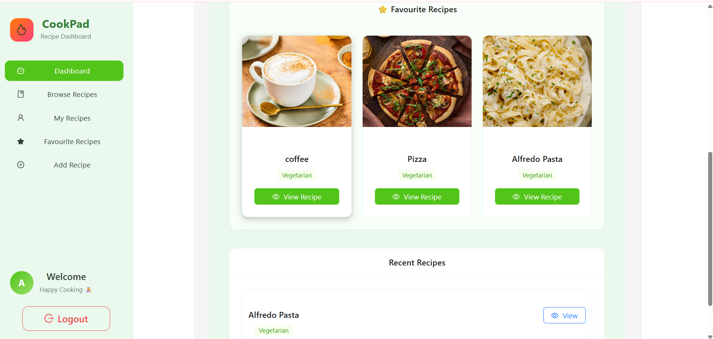
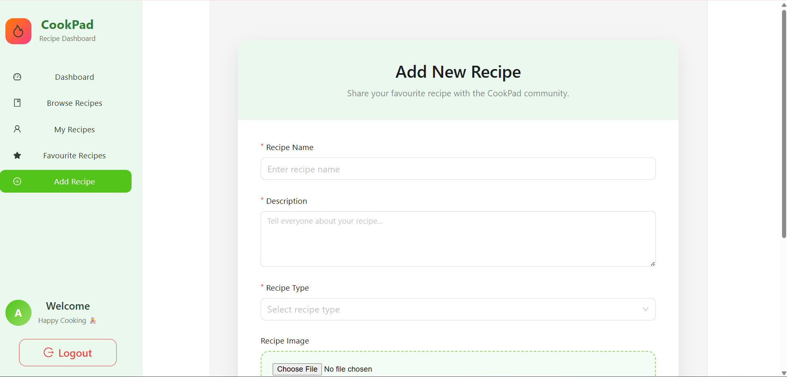
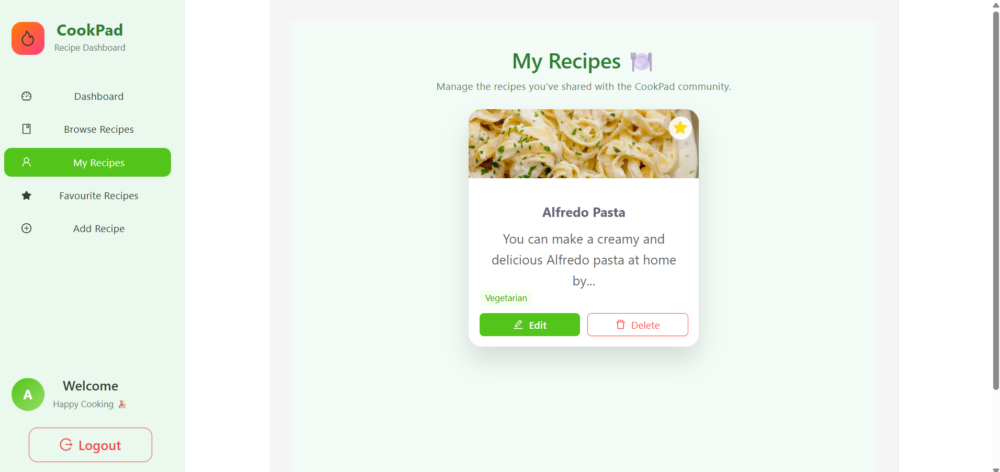
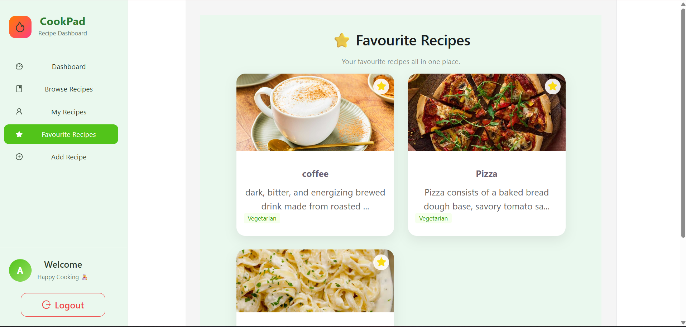

# CookPad

A full-stack recipe sharing web application where users can create, browse, manage, and save their favourite recipes.

Built using **Django REST Framework**, **React (Vite)**, **PostgreSQL**, and **Ant Design**.

---

# 📌 Features

- 🔐 User Authentication (JWT)
- 🍽️ Create, Update & Delete Recipes
- 📖 Browse Community Recipes
- ⭐ Add or Remove Favourite Recipes
- 📊 Personalized Dashboard
- 🔍 Search Recipes
- 🥗 Vegetarian & Non-Vegetarian Categories
- 🖼️ Recipe Image Upload
- 📱 Responsive User Interface

---

# 🛠 Tech Stack

## Frontend

- React
- Vite
- Ant Design
- Axios
- React Router

## Backend

- Django
- Django REST Framework
- JWT Authentication

## Database

- PostgreSQL

## Tools

- Git
- GitHub
- Postman

---
# Application Preview

## Register

Create a new account to access the application.



---

## Login

Secure JWT authentication for users.



---

## Browse Recipes

Browse recipes shared by the community using search and category filters.



---

## Dashboard

Overview of your recipes, favourites, and activity.



---

## Dashboard Statistics

Detailed dashboard showing recipe insights and quick actions.



---

## Add Recipe

Create and upload a new recipe with ingredients, category, and image.



---

## My Recipes

Manage all recipes created by the logged-in user.



---

## Favourite Recipes

View all recipes you've marked as favourites.


## Register

Create a new account to access the application.


---

## Login

Secure JWT authentication for users.


---

## Browse Recipes

Browse recipes shared by the community.


---

## Dashboard

Overview of recipes, favourites and user activity.


---

## Dashboard Statistics

Detailed dashboard with recipe insights.


---

## Add Recipe

Create and upload a new recipe with ingredients and image.


---

## My Recipes

Manage recipes created by the logged-in user.


---

## Favourite Recipes

Quickly access all favourite recipes.


---

# 📂 Project Structure

```
CookPad
│
├── api
├── cookpad
├── recipes
├── media
├── frontend
├── assets
├── manage.py
├── requirements.txt
└── README.md
```

---

# ⚙️ Installation

## Clone Repository

```bash
git clone https://github.com/your-github-username/cookpad.git
```

## Backend

```bash
pip install -r requirements.txt

python manage.py migrate

python manage.py runserver
```

## Frontend

```bash
npm install

npm run dev
```

---

# 🔐 Authentication

- JWT Authentication
- User Registration
- User Login
- Protected API Endpoints

---

# 📡 API Endpoints

| Method | Endpoint | Description |
|--------|----------|-------------|
| POST | `/api/register/` | Register User |
| POST | `/api/login/` | Login |
| GET | `/api/recipes/` | Get Recipes |
| POST | `/api/recipes/` | Add Recipe |
| PUT | `/api/recipes/<id>/` | Update Recipe |
| DELETE | `/api/recipes/<id>/` | Delete Recipe |
| GET | `/api/favourite/` | Favourite Recipes |
| GET | `/api/dashboard/` | Dashboard Data |

---

# 🚀 Future Improvements

- Recipe Ratings
- Recipe Comments
- User Profiles
- Pagination
- Advanced Filters
- Dark Mode

---

# 👩‍💻 Author

**Aanchal**

Backend Developer | Django | React | PostgreSQL